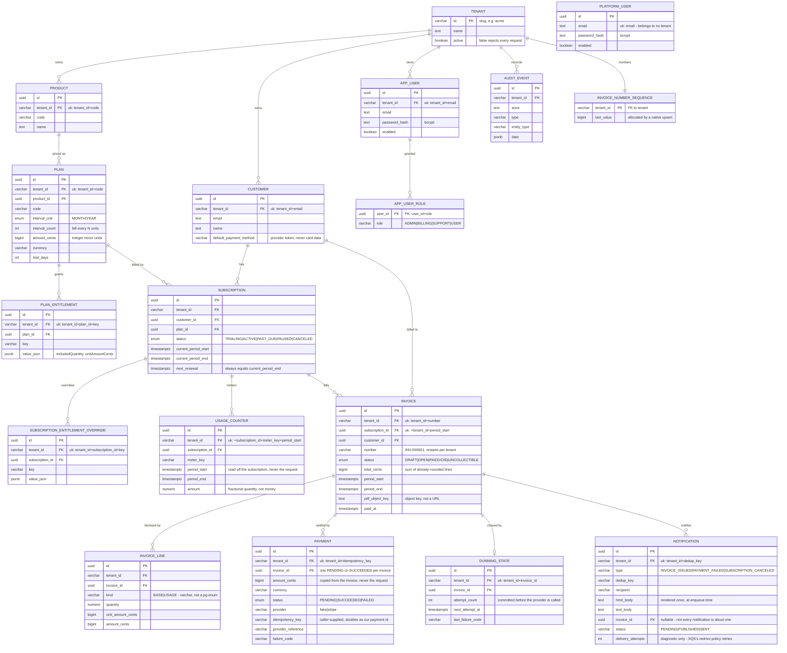

# Subscription Hub

A multi-tenant billing and subscription management backend for SaaS
applications, built with Spring Boot. This is a portfolio project — the goal
is to demonstrate real-world backend engineering practices (multi-tenancy,
layered architecture, migrations, error handling, API design) well enough to
walk through in a Senior Java/Spring Boot interview.

[](https://github.com/lumjahaj/subscription-hub/actions/workflows/ci.yml)

---

## What it does

Subscription Hub models the backend of a billing system that serves multiple
tenants (SaaS customers) from one deployment:

- **Tenants** are resolved per-request from a verified JWT claim, and every
  tenant-owned row is isolated by a `tenant_id` column.
- **Authentication** issues signed tokens carrying the caller's tenant and roles,
  with role-based rules on every write endpoint.
- **Tenant provisioning** is a platform-admin API: a platform administrator,
  whose token names no tenant, creates a tenant together with its first admin
  (a generated password, returned once), and can deactivate or reactivate it.
- **Catalog** — tenants define `Product`s, each with one or more `Plan`s
  (interval, price in cents, currency, trial length), and optional
  `PlanEntitlement`s (feature flags/limits attached to a plan).
- **Customers** belong to a tenant and subscribe to plans.
- **Subscriptions** track lifecycle state (`TRIALING`, `ACTIVE`, `PAST_DUE`,
  `PAUSED`, `CANCELED`) and billing period timestamps, and roll forward
  automatically once a billing period closes.
- **Usage metering** records per-period metered usage against a subscription
  (`emails.sent`, `api.calls`, …) as an atomic running total, so concurrent
  requests for the same meter can't lose increments.
- **Billing** turns a closed period into an invoice: a `BASE` line for the
  plan's recurring charge plus `USAGE` lines priced from the metered
  counters, with per-tenant human-readable invoice numbers.
- **Invoice PDFs** are rendered from an HTML template and stored in MinIO
  (S3-compatible object storage), then streamed back through the API.
- **Payments** collect an invoice through a provider port. The default provider
  is an in-process fake — no account, no network — and Stripe is opt-in by
  config. Neither reports the outcome from the API call itself: a payment is
  created `PENDING` and settled only by a provider event (a webhook, for
  Stripe), so both providers share one settlement path and one set of rules.

- **Dunning** collects automatically. A customer's stored payment method is
  charged once an invoice is issued; a failure marks the subscription
  `PAST_DUE` and schedules a retry on a lengthening backoff. A later success
  puts the subscription back to `ACTIVE`; running out of attempts writes the
  invoice off as `UNCOLLECTIBLE` and cancels the subscription.
- **Notifications** email the customer through a transactional outbox: an
  invoice or a dunning state change writes an outbox row in the same
  transaction, a relay job moves it onto an SQS queue, and a listener sends
  an HTML/text email (the invoice PDF attached, when there is one) over
  SMTP. Locally and in tests the queue is ElasticMQ and the inbox is
  Mailpit — both stand in for their real counterparts (SQS, Amazon SES) the
  same way MinIO stands in for S3.

Audit logging and observability are on the roadmap but not yet built —
see [`CLAUDE.md`](CLAUDE.md) for the architecture and conventions, and the
state skill linked at the bottom for the detailed current state and an
honest list of what's deliberately missing.

---

## Architecture

Feature-based modules under `dev.lumjahaj.subscription.hub`, each layered the
same way:

```
common/          cross-cutting: error handling, logging, OpenAPI config
auth/            users, roles, JWT issuing
tenancy/         tenant resolution, TenantContext, tenant domain model
catalog/         Product, Plan, PlanEntitlement
customer/        Customer
subscription/    Subscription, renewal
usage/           metered usage counters
billing/         Invoice, invoice lines, PDF rendering and storage
payment/         provider port, fake + Stripe adapters, webhook settlement
dunning/         automatic collection, retry schedule, PAST_DUE lifecycle
```

Each feature module follows `api → app → domain ← infra`:

- **`api`** — REST controllers, request/response DTOs, mappers
- **`app`** — application services holding business rules
- **`domain`** — domain models and repository interfaces (ports)
- **`infra/jpa`** — JPA entities and Spring Data repositories (adapters)

`billing` additionally has `infra/pdf` and `infra/storage`, and `payment` has
`infra/gateway`: each outside system (database, rendering library, object store,
payment provider) sits behind its own port rather than in one catch-all adapter
package.

Repositories follow a fixed trio pattern: a domain-layer `XxxRepository`
interface (the port the app layer depends on), an infra-layer
`XxxRepositoryImpl` adapter, and a Spring Data `XxxJpaRepository`. This keeps
Spring Data's query-naming machinery out of the domain contract.

### Data model

Single Postgres database, single schema. Every tenant-owned table carries a
`tenant_id` column — see [Multi-tenancy](#multi-tenancy) below.



`TENANT` is drawn connected only to the tables nothing else owns. Every other
entity above carries a `tenant_id` of its own — 16 of the 17 tables do — and
drawing all of those edges would bury the billing path.

`audit_event` exists but nothing writes to it yet; `invoice.status` only reaches
`OPEN`, `PAID` and `UNCOLLECTIBLE` today.

To explore the schema interactively instead, pgAdmin is already running on
[localhost:8081](http://localhost:8081): connect to the `postgres` service, then
right-click the database → **ERD For Database** for a draggable, PNG-exportable
diagram generated from live foreign keys.

### Multi-tenancy

Single database, single schema, row-level isolation via a `tenant_id` column
on every tenant-owned table:

1. Every request carries `Authorization: Bearer <jwt>`, obtained from
   `POST /api/auth/token`.
2. `TenantResolverFilter` reads the token's signed `tenant_id` claim, re-checks
   the tenant is still active, and populates a request-scoped `TenantContext`.
3. Application services read the current tenant from `TenantContext` and
   every repository query is scoped by it — never by a tenant ID taken from
   the request body.

There is deliberately **no `X-Tenant-Id` header**. It existed until
authentication landed, and it meant the tenant was whatever the caller typed:
row-level isolation protected each tenant from the others' *bugs*, but nothing
stopped someone from simply claiming to be another tenant. Taking it from a
signed claim is what closes that.

No token returns `401 UNAUTHENTICATED`; an authenticated caller lacking the
required role returns `403 ACCESS_DENIED`.

**Platform administrators** are the one principal outside any tenant. They log
in at `POST /api/platform/auth/token` against a separate `platform_user` table,
and their token carries `roles=["PLATFORM_ADMIN"]` and no `tenant_id` at all.
The two kinds of token cannot stand in for each other: `/api/platform/**`
requires `PLATFORM_ADMIN`, so a tenant ADMIN gets `403`, and every tenant
endpoint requires a `tenant_id` claim, so a platform token gets `403` too.
Deactivating a tenant takes effect on its next request, even for tokens already
issued, because the tenant's `active` flag is re-checked on every request.

### Payments

Charging money is the one place where "retry it" and "roll it back" stop being
free, so three things are deliberate:

- **The provider call happens outside any transaction.** A `PENDING` payment is
  reserved in one short transaction, the provider is called with none open, and
  the reference is recorded in a second. A rollback cannot un-charge a card, and
  holding a database connection open across a network call is how a pool dies.
- **One charge per invoice is enforced by the database.** A partial unique index
  allows at most one `PENDING`-or-`SUCCEEDED` payment per invoice. Code checks
  the invoice is open first, but two concurrent requests both pass that check;
  the index is what makes the loser fail *before* reaching the provider.
- **Settlement is idempotent by state, not by remembering event ids.** Only a
  `PENDING` payment can settle, and it settles once, so a redelivered,
  duplicated or out-of-order event changes nothing — and providers guarantee
  none of those three won't happen.

A caller must send an `Idempotency-Key`; it replays the first result rather than
charging twice, and it is the only way to resume a payment the provider never
acknowledged.

**Dunning** builds on that. `DunningJob` charges invoices that are still open,
using the payment method stored on the customer, and stops at a configured
number of attempts. It is a separate job from the billing cycle for one
concrete reason: settlement is asynchronous, so "charge, then decide whether to
renew" would depend on a webhook that arrives long after the run has finished.
The job therefore only *starts* attempts and never reads their result — the
settlement path reports the outcome, and dunning decides what it means for the
subscription. Attempts are counted before the provider is called, so a crash
costs one retry instead of re-charging the customer on every tick.

### Notifications

An invoice being issued and a dunning outcome (payment failed, subscription
canceled) each write a row to a `notification` outbox table, in the same
transaction as the change that caused it — publishing to a queue can't be
part of that same atomic commit (the dual-write problem), so the durable
half is the row, not the message. A relay job moves `PENDING` rows onto an
SQS queue with no transaction open around the publish call, and a listener
(`@SqsListener`, Spring Cloud AWS) picks the message up, attaches the
invoice PDF when there is one, and sends the email over SMTP.

That gives SQS's retry machinery for free: a delivery failure simply isn't
acknowledged, so the message redelivers after the queue's visibility
timeout, and a redrive policy moves it to a dead-letter queue after too many
attempts, instead of hand-written backoff code. Delivery is idempotent by
status — only a row that isn't already `SENT` gets delivered — so a
redelivered or duplicated message never sends the same email twice.

Locally and in CI, ElasticMQ (SQS-compatible) and Mailpit (SMTP + a REST
inbox tests can assert against) stand in for real SQS and Amazon SES; only
an endpoint changes for production.

### Error handling

Errors are returned as RFC 7807 `application/problem+json`, with a `code`
and a `requestId` (for log correlation) on every error response.

---

## Tech stack

- Java 21, Spring Boot 3.5.6 (Web, Data JPA, Validation, Security)
- PostgreSQL 17, Flyway migrations, Hibernate 6
- MinIO for object storage, reached with the **AWS SDK v2 for S3** — MinIO is
  S3-compatible, so the same code runs against real S3 or R2 by changing an
  endpoint
- openhtmltopdf + Thymeleaf (as a library, not the Spring MVC starter) for
  rendering invoice PDFs
- `stripe-java` for the opt-in Stripe adapter. **No Stripe account is needed to
  build, run or test this project**: the default provider is the in-process
  fake, the adapter is exercised against `stripe-mock` (Stripe's own local API
  server, as a container), and webhook tests sign their payloads themselves,
  since verification is an HMAC against a shared secret. That is why the Stripe
  path has CI coverage a real-account integration could never have
- Spring Cloud AWS SQS for the notification queue, backed by **ElasticMQ**
  locally and in tests — the same "vendor is a config value" shape as MinIO/S3
- `spring-boot-starter-mail` for outbound email, backed by **Mailpit** locally
  and in tests as a stand-in for a real SMTP provider (e.g. Amazon SES)
- Maven
- springdoc-openapi (Swagger UI)
- Docker Compose (Postgres + pgAdmin + MinIO + Mailpit + ElasticMQ)
- Testcontainers — integration tests run against a real Postgres, a real MinIO,
  Mailpit, ElasticMQ and Stripe's own `stripe-mock`, not hand-written mocks
- GitHub Actions CI (`mvn verify`; the tests provision their own containers)

---

## Running locally

### Prerequisites

- Docker Desktop
- JDK 21
- (Optional) IntelliJ IDEA — the `requests/*.http` files are IntelliJ REST
  Client scripts

### 1. Start the infrastructure

```bash
git clone https://github.com/lumjahaj/subscription-hub.git
cd subscription-hub
cp .env.example .env
docker compose up -d
```

This brings up:

| Service        | URL / Port              | Notes                                   |
|----------------|--------------------------|------------------------------------------|
| Postgres       | `localhost:5432`         | DB/user/password from `.env`             |
| pgAdmin        | http://localhost:8081    | Login with `PGADMIN_DEFAULT_EMAIL`/`PASSWORD` from `.env`; add a server with host `postgres` |
| MinIO (S3 API) | `localhost:9000`         | Used by the app to store invoice PDFs    |
| MinIO console  | http://localhost:9001    | Login with `MINIO_ROOT_USER`/`MINIO_ROOT_PASSWORD` from `.env`; browse stored PDFs under the `invoices` bucket |
| Mailpit (SMTP) | `localhost:1025`         | Used by the app to send notification emails — no credentials needed |
| Mailpit inbox  | http://localhost:8025    | Every email the app sends lands here; nothing leaves the machine |
| ElasticMQ (SQS)| `localhost:9324`         | Used by the app as the notification queue — no credentials needed |
| ElasticMQ UI   | http://localhost:9325    | Browse queue depth for `notifications`/`notifications-dlq` |

Flyway runs the schema migrations automatically on application startup, and the
`invoices` bucket is created on the first PDF upload — no manual `psql` or
bucket-creation step needed. The `notifications`/`notifications-dlq` queues are
defined in `docker/elasticmq/elasticmq.conf` and exist as soon as the container
starts.

### 2. Run the application

The Spring Boot app itself is **not** part of `docker-compose.yml`; run it
directly against the containerized Postgres:

```bash
./mvnw spring-boot:run -Dspring-boot.run.profiles=dev
```

Or run `SubscriptionHubApplication` from your IDE with the `dev` profile
active. It starts on **http://localhost:8080**.

The `dev` profile is what puts `db/seed` on the Flyway path, and therefore what
creates the login accounts below. It is deliberately not the default: seed data
carries a publicly known password, so an environment that forgets to ask for it
gets none rather than silently inheriting an admin account.

### 3. Explore the API

Swagger UI: **http://localhost:8080/swagger-ui/index.html**
OpenAPI JSON: `http://localhost:8080/v3/api-docs`

Every request against a tenant-owned endpoint needs a bearer token. Get one
first:

```bash
curl -s -X POST http://localhost:8080/api/auth/token \
  -H 'Content-Type: application/json' \
  -d '{"tenantId":"acme","email":"admin@acme.test","password":"subscriptionhub"}'
```

then send it:

```
GET /api/products
Authorization: Bearer <token>
```

In Swagger UI, use the **Authorize** button and paste the token.

Two tenants are seeded for local testing (`acme` and `demo`), each with an
admin, plus one read-only user for trying the role rules:

| Tenant | Email               | Role    | Password         |
|--------|---------------------|---------|------------------|
| acme   | `admin@acme.test`   | ADMIN   | `subscriptionhub` |
| demo   | `admin@demo.test`   | ADMIN   | `subscriptionhub` |
| acme   | `support@acme.test` | SUPPORT | `subscriptionhub` |

These exist only under the `dev` profile. Reads are open to any authenticated
role; writes need `ADMIN` (catalog) or `ADMIN`/`BILLING` (customers,
subscriptions, usage, invoices, payments) — logging in as `support@acme.test` is
the quickest way to see a `403`.

To create a tenant, log in as the seeded platform administrator
(`platform@subscriptionhub.test` / `subscriptionhub`, also `dev` profile only):

```bash
curl -s -X POST http://localhost:8080/api/platform/auth/token \
  -H 'Content-Type: application/json' \
  -d '{"email":"platform@subscriptionhub.test","password":"subscriptionhub"}'
```

```
POST /api/platform/tenants
Authorization: Bearer <platform token>

{ "id": "globex", "name": "Globex Corporation", "adminEmail": "admin@globex.test" }
```

The `201` response contains the new admin's `initialPassword`, the only time it
is ever shown. `requests/platform.http` walks through the rest: logging in as
that admin, deactivation and the cross-direction `403`s.

Outside the `dev` profile there is no seeded platform administrator. Set
`PLATFORM_ADMIN_EMAIL` and `PLATFORM_ADMIN_PASSWORD` (at least 12 characters)
and the first one is created at startup, only while none exists yet.

Paying an invoice additionally requires an `Idempotency-Key` header:

```
POST /api/invoices/{id}/payments
Authorization: Bearer <token>
Idempotency-Key: <any unique string>

{ "paymentMethod": "pm_card_visa" }
```

The fake provider recognises Stripe's own test payment-method ids, so the same
requests work against either provider: `pm_card_visa` succeeds,
`pm_card_visa_chargeDeclined` is declined, and the fake-only
`pm_fake_provider_unavailable` simulates an unreachable provider.

For automatic collection, store a method on the customer instead — the token is
kept but never returned, so the response reports `hasDefaultPaymentMethod`:

```
PUT /api/customers/{id}/payment-method
{ "paymentMethod": "pm_card_visa_chargeDeclined" }
```

Dunning then runs hourly. To watch a full cycle without waiting, shorten its
schedule with an environment variable and restart:

```bash
DUNNING_CYCLE_CRON="*/20 * * * * *" ./mvnw spring-boot:run -Dspring-boot.run.profiles=dev
```

Pass it as an environment variable, not `-Dspring-boot.run.arguments`: Maven
splits the six-field expression on spaces and the application refuses to start.
`requests/dunning.http` walks through the states from there.

Example request files covering happy paths, validation errors,
conflict/not-found, role denials, and tenant-isolation checks live in
[`requests/`](requests/) (IntelliJ HTTP Client format).

---

## Running tests

```bash
./mvnw verify
```

This is also what runs in CI on every push/PR to `main` (see
[`.github/workflows/ci.yml`](.github/workflows/ci.yml)). Integration tests
provision their own Postgres, MinIO, Mailpit, ElasticMQ and stripe-mock via
Testcontainers, so nothing needs to be running first — invoice totals, tenant
isolation, PDF round trips, concurrent charge attempts, signed webhook
settlement, the whole dunning lifecycle, and notification delivery through a
real queue and a real inbox are all verified against the real thing rather
than mocks.

---

## Project docs

[`CLAUDE.md`](CLAUDE.md) is the living architecture and conventions doc — data
model, module conventions, and the rules each module follows. The
[data model diagram](#data-model) above is checked against the live schema by
`DataModelDiagramIntegrationTest`, so it can't silently drift as migrations
land.

[`.claude/skills/subscription-hub-state/SKILL.md`](.claude/skills/subscription-hub-state/SKILL.md)
holds the detailed current state: what is built, why each decision was made, and
an honest list of known gaps and what is deliberately not done.

---

## License

[MIT](LICENSE)